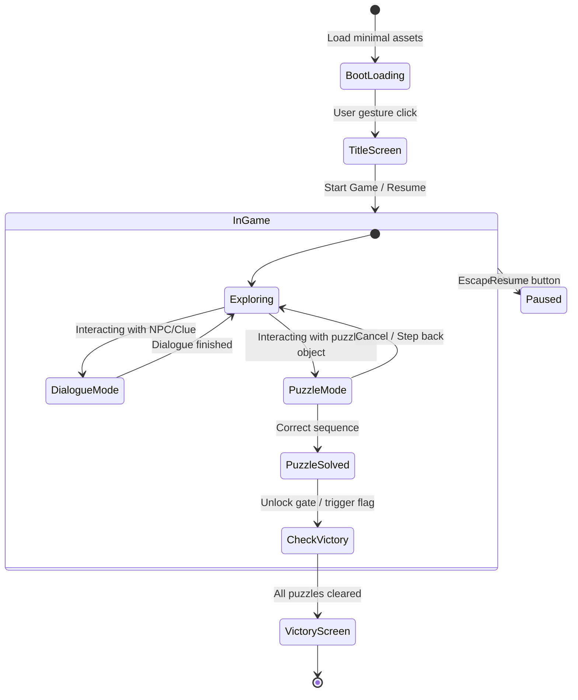

# Game Production & Scoping Workflow

This skill equips the AI agent with a rigorous framework to scope, plan, and structure web game projects (Phaser, Three.js, Pixi.js) before writing production code.

## 1. The Scope Guardian Protocol
When asked to build a web game or feature:
1. **Never generate code for 10 systems at once.** A web game requires rapid validation of the core interaction loop.
2. **Enforce the Micro-Vertical Slice:** The initial prototype must encompass exactly **one playable room or 3 minutes of gameplay** with complete graphics, audio, UI, and clear win/lose conditions.
3. **Establish Technical Budgets:**
   - Initial Load Payload: < 15 MB
   - Maximum Draw Calls: < 50 for 2D, < 100 for 3D
   - Target Framerate: 60 FPS on mid-tier mobile browsers

---

## 2. One-Page GDD Specification

Generate a `docs/GDD.md` document following this exact template:

```markdown
# [Game Title]: Game Design Document (One-Pager)

## 1. High Concept & The Hook
- **Genre**: [e.g. Sokoban Puzzle / Mystery Visual Novel / Turn-based Board Game]
- **Target Audience & Platform**: Web Desktop (Itch.io/Poki) & Mobile Web
- **The 5-Second Hook**: [What does the player see and click within the first 5 seconds?]

## 2. Core Gameplay Loop
[Action A: Explore / Inspect] -> [Action B: Solve Puzzle / Choose Option] -> [Action C: Trigger Event / Progression] -> [Reward / New State]

## 3. The 3 Core Pillars (Rules that cannot be broken)
1. **Pillar 1**: [e.g. Single-touch / single-click control scheme]
2. **Pillar 2**: [e.g. Zero dead-ends; player can always undo or restart without penalty]
3. **Pillar 3**: [e.g. Story unfolds through interactive clues rather than long exposition]

## 4. Micro-Vertical Slice (MVP Milestones)
- [ ] Phase 1: Greybox prototype (shapes only, verifying puzzle logic)
- [ ] Phase 2: First Playable Room (1 puzzle, 1 dialogue tree, final art style)
- [ ] Phase 3: Polish & Web Optimizations (Sound unlock, save state, DPR clamp)
```

---

## 3. Game State Machine Diagram
Always document the game states using Mermaid before writing scene code:


