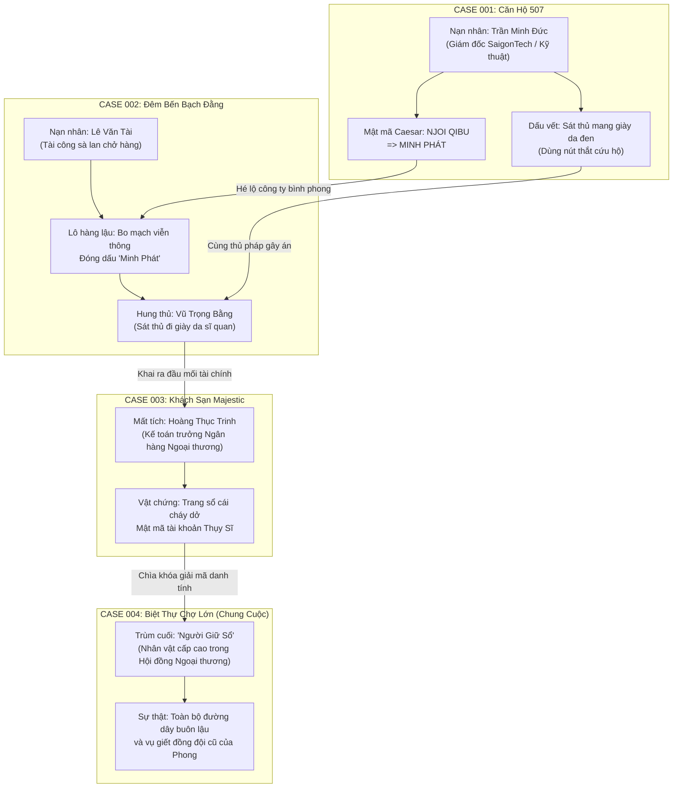

# 📜 BẢN ĐỒ CỐT TRUYỆN VĨ MÔ: MINH SÁT (明察)
## HỒ SƠ TỔ CHỨC "NGƯỜI GIỮ SỔ" & MẠNG LƯỚI NGẦM SÀI GÒN

---

## 1. THẾ GIỚI QUAN: SÀI GÒN GIAO THỜI (LATE 1980s – ĐỔI MỚI)

Bối cảnh của **Minh Sát** diễn ra vào những năm cuối thập niên 1980 và đầu thập niên 1990 tại Sài Gòn — một đô thị đang cựa mình thức giấc giữa làn sóng Đổi Mới. 

### Không Khí & Cảnh Quan (Neo-Noir Sài Gòn)
* **Những Cơn Mưa Bến Cảng:** Mưa nhiệt đới rả rích trút xuống sông Sài Gòn, phản chiếu ánh đèn halogen vàng vọt và những biển hiệu huỳnh quang đầu tiên của các công ty liên doanh.
* **Đời Sống Hẻm & Chợ Trời:** Tiếng muỗng gõ lách cách của các quán cà phê vợt mở thâu đêm bên hẻm Chợ Lớn; tiếng rao đêm khàn đặc; chợ trời Huỳnh Thúc Kháng tấp nập linh kiện điện tử, băng từ cassette, máy bộ đàm và đồng hồ Liên Xô/Nhật Bản nhập lậu.
* **Sự Va Đập Của Hai Thời Đại:** Một bên là tàn tích của kỷ cấp phát tem phiếu, xe đạp Phượng Hoàng và hồ sơ lưu trữ bằng giấy Manila bấm kim; một bên là những chiếc ô tô Lada, Toyota Crown đời cũ, đồng đô la Mỹ chuyền tay nhau dưới đáy bao thuốc lá ba số 555, và những chiếc máy vi tính đầu tiên xuất hiện trong các phòng điều hành xuất nhập khẩu.

---

## 2. TỔ CHỨC BÓNG MA: "NGƯỜI GIỮ SỔ" (THE LEDGER KEEPER)

### Bản Chất & Cơ Cấu
"Người Giữ Sổ" không phải là một băng đảng giang hồ dao búa đơn thuần, mà là một **nghiệp đoàn tài chính bóng ma** quy tụ những kẻ nắm huyết mạch kinh tế ngầm:
* **Các Pháp Nhân Bình Phong:** Thành lập các công ty xuất nhập khẩu thiết bị viễn thông và máy móc để hợp thức hóa dòng ngoại tệ bẩn (tiêu biểu là *Minh Phát Holdings*).
* **Đường Dây Vận Chuyển Bến Bãi:** Sử dụng sà lan đường thủy nội địa từ Vũng Tàu, Cần Giờ ngược dòng sông Sài Gòn để tuồn linh kiện và tài sản ngầm.
* **Quyển Sổ Cái Đen (The Black Ledger):** Một cuốn sổ kế toán mã hóa ghi chép toàn bộ danh sách các khoản lại quả, tài khoản ngân hàng hải ngoại và những cái tên bảo kê quyền lực.

### Phương Thức Hành Động
Bất kỳ cá nhân nào trong đường dây có dấu hiệu giao nộp tài liệu cho thanh tra hoặc tìm cách sao chép Quyển Sổ Cái đều bị thủ tiêu không dấu vết. Các vụ án luôn được dàn dựng công phu: **treo cổ trong phòng kín, trượt chân rơi xuống sông ban đêm, hoặc ngộ độc khí than**.

---

## 3. HỒ SƠ THÁM TỬ CHÍNH: TRẦN PHONG ("PHONG MẮT QUẠ")

* **Nghề nghiệp:** Cựu Đội phó Đội Cảnh sát Hình sự, nay điều hành một văn phòng thám tử tư núp bóng tiệm sửa đồng hồ cơ cũ trên đường Pasteur.
* **Quá khứ & Vết thương:** 
  - Ba năm trước, trong chuyên án triệt phá đường dây buôn lậu xăng dầu bến cảng, người đồng đội thân thiết nhất của Phong bị sát hại dã man trên một sà lan bỏ hoang.
  - Cấp trên khi ấy bất ngờ ra lệnh đình chỉ điều tra và khép lại vụ án như một vụ cướp thông thường. Phong từ chối tuân lệnh, làm rò rỉ hồ sơ và bị tước quân tịch.
* **Tính cách & Thói quen:**
  - Lạnh lùng, hoài nghi xã hội, cực kỳ nhạy cảm với các dấu vết cơ học và tâm lý dối trá của con người.
  - Luôn mang theo chiếc bật lửa Zippo khắc hình con mắt và một chiếc kẹp cà vạt bằng bạc cũ của người bạn quá cố.
  - Động lực: Không vì tiền bạc, mà để bóc trần chân tướng của kẻ mang biệt danh "Người Giữ Sổ" — kẻ đã ra lệnh giết bạn mình năm xưa.

---

## 4. SƠ ĐỒ MẠNG LƯỚI 4 VỤ ÁN (THE 4-CASE NARRATIVE WEB)

---

## 5. TỔNG QUAN CHI TIẾT TỪNG VỤ ÁN

### 📁 Case 001: Vụ Án Căn Hộ 507 (Micro-Vertical Slice Hiện Tại)
* **Hiện trường:** Căn hộ 507 chung cư Riviera, cửa khóa chốt trong, thi thể nạn nhân Trần Minh Đức treo cổ trên xà gồ chịu lực.
* **Bản chất án mạng:** Nạn nhân phát hiện công ty viễn thông của mình đang bị biến thành công cụ rửa tiền cho Minh Phát Holdings và lén lút sao chép dữ liệu. Hắn bị đầu độc mê man bằng Zolpidem và bị sát thủ đột nhập từ ban công kỹ thuật treo cổ ngụy tạo.
* **Manh mối vĩ mô:** 
  - Mảnh giấy rách `NJOI QIBU` (Caesar Shift -1 $\rightarrow$ `MINH PHÁT`).
  - Lời thú nhận của bảo vệ Huy: Có một gã đàn ông bí ẩn đi giày da đen hối lộ 50 triệu để ngắt camera 15 phút.

### 📁 Case 002: Bóng Đêm Bến Bạch Đằng
* **Hiện trường:** Sà lan số hiệu SG-0419 neo đậu bất hợp pháp giữa dòng sông Sài Gòn trong cơn giông nửa đêm.
* **Bản chất án mạng:** Tài công Lê Văn Tài bị đâm bằng một nhát dao găm chuyên dụng và ném xác xuống sông nhằm bịt đầu mối về một chuyến hàng linh kiện điện tử bí mật.
* **Manh mối vĩ mô:**
  - Các thùng hàng gỗ có đóng dấu mộc đỏ của Công ty Minh Phát.
  - Bắt giữ được nghi phạm Vũ Trọng Bằng — kẻ mang đôi giày da sĩ quan đế cao su có hoa văn trùng khớp với dấu chân để lại trên ban công Căn hộ 507.

### 📁 Case 003: Bản Báo Cáo Cháy Dở Tại Majestic
* **Hiện trường:** Phòng 302 khách sạn cổ Majestic nhìn ra sông, cửa phòng mở toang, vali bị lục tung, có dấu hiệu giằng co và đốt tài liệu trong bồn tắm.
* **Bản chất án mạng:** Nữ kế toán trưởng Hoàng Thục Trinh mang theo bản sao Quyển Sổ Cái dự định trốn lên tàu sang Pháp thì bị bắt cóc.
* **Manh mối vĩ mô:**
  - Tờ giấy than cháy dở lưu lại dãy số tài khoản ủy thác ngân hàng hải ngoại.
  - Chiếc thẻ hội viên Câu lạc bộ Du thuyền Chợ Lớn của kẻ chủ mưu giấu mặt.

### 📁 Case 004: Biệt Thự Chợ Lớn (Đêm Phán Quyết)
* **Hiện trường:** Biệt thự cổ thời Pháp của một nhà tư sản tài chính kín tiếng ở Quận 5.
* **Cao trào đối đầu:** Phong thâm nhập vào buổi dạ tiệc kín, sử dụng tất cả bằng chứng thu thập được từ 3 vụ án trước (chứng từ Minh Phát, lời khai của Bằng, bản sao sổ cái của Trinh) để ép "Người Giữ Sổ" phải lộ diện.
* **Lựa chọn kết cục (Dual Endings):**
  - *Ending A (Công Lý Pháp Luật):* Chuyển giao toàn bộ hồ sơ cho Viện Kiểm sát, chấp nhận một phần mạng lưới có thể trốn thoát bằng tiền bạc nhưng giữ trọn vẹn danh dự người điều tra.
  - *Ending B (Phán Quyết Cá Nhân):* Tự tay kết liễu kẻ thủ ác để trả thù cho người đồng đội năm xưa, chính thức biến mình thành một bóng ma cô độc trong đêm đen Sài Gòn.

---

## 6. TIÊU CHUẨN GIÁM SÁT TÍNH NHẤT QUÁN (CONTINUITY CHECKLIST CHO AI & BIÊN KỊCH)

1. **Dấu Vết Đôi Giày Da Đen:** Đôi giày xuất hiện ở Case 001 (bảo vệ Huy nhìn thấy) $\rightarrow$ Để lại dấu vết ở ban công Case 001 $\rightarrow$ Được bắt giữ ở Case 002 trên sà lan.
2. **Kỹ Thuật Nút Thắt Dây Dù Cứu Hộ:** Xuất hiện ở Case 001 $\rightarrow$ Được lý giải ở Case 002 rằng sát thủ Bằng từng phục vụ trong lực lượng cứu nạn đường sông trước khi xuất ngũ làm bảo kê bến bãi.
3. **Pháp Nhân Minh Phát:** Xuất hiện từ mật mã Case 001 $\rightarrow$ Lô hàng lậu Case 002 $\rightarrow$ Tài khoản rửa tiền Case 003 $\rightarrow$ Chân tướng ông trùm ở Case 004.
