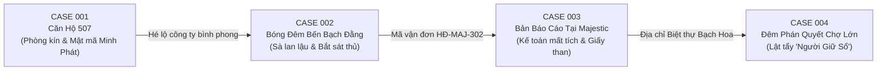

# 📜 KỊCH BẢN CHI TIẾT TOÀN BỘ 4 VỤ ÁN: MINH SÁT (明察)
## SÀI GÒN NEO-NOIR DETECTIVE TETRALOGY

> **Tác giả / Thiết kế:** Mystery Narrative Architect  
> **Phong cách:** 1980s Saigon Neo-Noir, Fair-Play Whodunit, The Three-Clue Rule, Puzzle Dependency Graphs (PDG)  
> **Nhân vật trung tâm:** Thám tử tư Trần Phong ("Phong Mắt Quạ")

---

# 📁 TỔNG QUAN HÀNH TRÌNH ĐẠI ÁN (THE 4-CASE ODYSSEY)

---

# 📁 CASE 001: VỤ ÁN CĂN HỘ 507 (THE LOCKED-ROOM STAGED SUICIDE)

### 1. Hồ Sơ Vụ Án
* **Mã hồ sơ:** `#507/CSHS-ĐT`
* **Địa điểm:** Căn hộ 507, Chung cư Riviera Residence (Quận 2, TP.HCM).
* **Nạn nhân:** Trần Minh Đức (38 tuổi), Giám đốc Xí nghiệp Viễn thông SaigonTech.
* **Hiện trường:** Nạn nhân treo cổ trên xà gồ phòng khách; cửa chính khóa chốt trong; ly cà phê đọng cặn Zolpidem; rèm cửa ban công hé mở; mẩu giấy vo tròn góc phòng.

### 2. Sự Thật Hiện Trường (The Ground Truth)
* **Hung thủ:** Vũ Trọng Bằng (Sát thủ đội cứu nạn đường sông do "Người Giữ Sổ" thuê).
* **Thời gian tử vong:** 22:10 – 22:15 đêm 18/09.
* **Động cơ:** Bịt đầu mối do Đức lén sao chép chứng từ rửa tiền của công ty bình phong Minh Phát.
* **Thủ đoạn dàn cảnh:**
  1. Đức bị đầu độc bằng thuốc ngủ Zolpidem hòa vào cà phê lúc 20:30.
  2. Bằng hối lộ bảo vệ Đỗ Quang Huy 50 triệu rút jack camera tầng 5 từ 22:05 – 22:20.
  3. Bằng cạy cửa kính ban công từ hành lang kỹ thuật, đưa thi thể nạn nhân lên xà gồ, dùng **nút thắt dây dù cứu nạn bện đôi (slip-knot)** kéo căng từ bên ngoài rồi buông thi thể rơi xuống sàn lúc 22:15 tạo tiếng "bịch".
  4. Bằng rút lui qua ban công kỹ thuật trước khi camera bật lại lúc 22:20.

### 3. Ma Trận Bất Đối Xứng Nghi Phạm
* **Vũ Thanh Sơn (Hàng xóm 508, cựu quân nhân):**
  - *Biết:* Nghe cãi nhau lúc 20:30, nghe tiếng rơi lúc 22:15, nhận ra nút thắt cứu hộ đường sông.
  - *Giấu:* Sợ bị công an thẩm vấn phiền phức ảnh hưởng con cái.
  - *Điểm huyệt:* `EVD-07` (Ảnh nút thắt dây dù) $\rightarrow$ Khơi dậy lòng tự trọng người lính.
* **Đỗ Quang Huy (Bảo vệ ca đêm):**
  - *Biết:* Kẻ đi giày da đen đã lên tầng 5; camera bị ngắt có chủ đích.
  - *Giấu:* Nhận hối lộ 50 triệu; nợ độ cá banh 200 triệu ở Chợ Lớn.
  - *Điểm huyệt:* `EVD-05` (CCTV) + `EVD-03` (Vết cạy ban công) $\rightarrow$ Ép sụp đổ tâm lý (`composureDelta: -60`).

### 4. Hệ Thống 3 Manh Mối (The Three-Clue Rule)
* **Chứng minh Án mạng (không phải tự sát):**
  1. *Forensic:* `EVD-01` (Cặn thuốc Zolpidem liều cao trong tách cà phê).
  2. *Cơ học/Vật chứng:* `EVD-07` (Nút thắt dây dù cứu nạn bện đôi cần lực kéo từ ngoài).
  3. *Lời khai:* Lời khai ông Sơn về tiếng rơi 22:15 sau 1 giờ căn hộ im bặt.
* **Chứng minh Kẻ đột nhập & Tay trong:**
  1. *Kỹ thuật:* `EVD-05` (Băng CCTV ngắt đột ngột 15 phút 22:05 - 22:20).
  2. *Hiện trường:* `EVD-03` (Vết nạy kim loại cửa kính ban công).
  3. *Thú tội:* Lời khai của bảo vệ Huy thừa nhận nhận 50 triệu tiền cọc.

### 5. Mật Mã & Mục Tiêu Ẩn
* `EVD-12`: Mẩu giấy `NJOI QIBU` $\rightarrow$ Dịch Caesar Shift -1: `MINH PHAT` (Công ty TNHH Minh Phát Holdings) $\rightarrow$ Đầu mối dẫn sang Case 002.

---

# 📁 CASE 002: BÓNG ĐÊM BẾN BẠCH ĐẰNG (THE MIDNIGHT CARGO WHODUNIT)

### 1. Hồ Sơ Vụ Án
* **Mã hồ sơ:** `#602/CSHS-ĐT`
* **Địa điểm:** Sà lan neo đậu số hiệu SG-0419 và Kho hàng số 3, Bến Cảng Bạch Đằng (Quận 1, TP.HCM).
* **Nạn nhân:** Lê Văn Tài (45 tuổi), Tài công trưởng sà lan chuyên tuyến đường thủy Vũng Tàu - Sài Gòn.
* **Hiện trường:** Thi thể dạt vào mép bến lúc rạng sáng; buồng lái sà lan bị lục tung; vệt máu lau dở trên boong; các thùng gỗ chứa thiết bị viễn thông đóng dấu niêm phong "Minh Phát".

### 2. Sự Thật Hiện Trường (The Ground Truth)
* **Hung thủ:** Vũ Trọng Bằng (Tay sát thủ mang đôi giày da sĩ quan từ Case 001).
* **Thời gian gây án:** 01:30 – 01:45 sáng ngày 28/09 trong cơn mưa giông.
* **Động cơ:** Lê Văn Tài biết chiếc sà lan chở bo mạch viễn thông quân sự nhập lậu và vàng thỏi rửa tiền cho Minh Phát. Tài đòi tống tiền thêm 100 cây vàng nếu không sẽ nộp sổ hải trình cho công an cảng. "Người Giữ Sổ" ra lệnh cho Bằng thanh trừng Tài.
* **Thủ đoạn gây án:**
  1. Bằng hẹn gặp Tài trên sà lan lúc nửa đêm vờ giao tiền.
  2. Khi Tài cúi xuống kiểm tra bọc tiền giả, Bằng dùng dao găm chuyên dụng đâm một nhát chuẩn xác sau gáy (thủ pháp đặc nhiệm đường sông).
  3. Bằng ném xác Tài xuống sông, lục buồng lái tìm quyển sổ hải trình nhưng không thấy.
  4. Khi rời bến, Bằng ghé quán nước ven bờ mua gói thuốc lá 555 để bình tĩnh lại, vô tình để lại gói thuốc dính máu dưới gầm bàn.

### 3. Ma Trận Bất Đối Xứng Nghi Phạm
* **Vũ Trọng Bằng (40 tuổi, Thanh tra vận tải Minh Phát / Sát thủ giấu mặt):**
  - *Biết:* Chính hắn đã hạ sát Tài và dàn cảnh căn hộ 507.
  - *Giấu:* Quá khứ lính đặc nhiệm cứu nạn đường sông; vết xước trên cánh tay do giằng co với Tài.
  - *Motive to Lie:* Trốn án tử hình; bảo vệ đường dây của Người Giữ Sổ.
  - *Điểm huyệt:* `EVD-201` (Đôi giày da đế rãnh kim cương) + `EVD-204` (Con dao găm mẻ mũi tìm thấy dưới khoang máy).
* **Bùi Thị Mai ("Mai Cà Phê Cảng", 36 tuổi):**
  - *Biết:* Thấy bóng người mặc áo mưa trùm kín rời sà lan lúc 01:45 vào mua thuốc lá.
  - *Giấu:* Bán thuốc lá ngoại nhập lậu và số đề cho dân bến tàu.
  - *Motive to Lie:* Sợ bị tịch thu quầy hàng và bắt phạt hành chính.
  - *Điểm huyệt:* `EVD-203` (Bao thuốc 555 dính máu) $\rightarrow$ Thừa nhận nhận dạng dáng người và đôi giày da của gã khách.
* **Lâm "Chột" (30 tuổi, Thợ máy phụ sà lan):**
  - *Biết:* Tài cất giấu quyển sổ hải trình bí mật ở đâu.
  - *Giấu:* Đã lén rút ruột 2 kiện hàng bo mạch điện tử đem bán chợ trời Huỳnh Thúc Kháng lúc 22:00.
  - *Motive to Lie:* Sợ bị buộc tội ăn cắp tài sản quốc gia.
  - *Điểm huyệt:* `EVD-202` (Hóa đơn cầm đồ linh kiện) $\rightarrow$ Giao nộp quyển sổ hải trình giấu trong bình ắc quy sà lan.

### 4. Hệ Thống 3 Manh Mối (The Three-Clue Rule)
* **Chứng minh Vụ án mạng trên sà lan (không phải chết đuối):**
  1. *Forensic:* `EVD-205` (Vết thương sau gáy do dao găm sắc ngọt, phổi không có nước phù nề $\rightarrow$ Chết trước khi rơi xuống nước).
  2. *Vật chứng hiện trường:* `EVD-206` (Vết máu phản ứng Luminol trên sàn boong sà lan bị chùi dở bằng dầu diesel).
  3. *Thời gian:* Đồng hồ đeo tay Poljot của nạn nhân bị vỡ kim dừng lại đúng 01:35.
* **Chứng minh Vũ Trọng Bằng là thủ phạm:**
  1. *Dấu chân/Vật chứng:* `EVD-201` (Đôi giày da sĩ quan rãnh kim cương dính mỡ máy sà lan, trùng vết chân ban công Case 1).
  2. *Vũ khí:* `EVD-204` (Dao găm đặc nhiệm bị mẻ mũi, mảnh kim loại gãy tìm thấy trong khớp xương cổ nạn nhân).
  3. *Nhân chứng:* Lời khai chị Mai nhận dạng Bằng mua thuốc lá lúc 01:40 với bàn tay run rẩy.

### 5. Mật Mã & Đầu Mối Sang Case 003
* Trong quyển sổ hải trình thu hồi từ Lâm "Chột", trang cuối ghi lại dòng chữ:  
  `"Lô hàng mật SG-0419 thanh toán qua TK Ngoại Thương. Liên hệ Hoàng Thục Trinh - HĐ-MAJ-302"`.  
  $\rightarrow$ Chỉ dẫn trực tiếp đến **Phòng 302 Khách sạn Majestic**!

---

# 📁 CASE 003: BẢN BÁO CÁO CHÁY DỞ TẠI MAJESTIC (THE VANISHING ACCOUNTANT)

### 1. Hồ Sơ Vụ Án
* **Mã hồ sơ:** `#703/CSHS-ĐT`
* **Địa điểm:** Phòng 302, Khách sạn Majestic (Số 1 Đồng Khởi, Quận 1).
* **Nạn nhân:** Hoàng Thục Trinh (32 tuổi), Kế toán trưởng Ngân hàng Ngoại thương kiêm kế toán bí mật của Minh Phát Holdings.
* **Hiện trường:** Phòng suite nhìn ra sông bị lục tung; cửa sổ mở toang; trong bồn tắm có đống tro tàn giấy tờ bị đốt cháy dở; vali quần áo bị rạch khóa; vết máu nhỏ giọt kéo dài ra cầu thang bộ nhân viên.

### 2. Sự Thật Hiện Trường (The Ground Truth)
* **Hung thủ/Kẻ bắt cóc:** Jean-Pierre Nam (Quản lý trưởng ca đêm khách sạn Majestic) kết hợp với tay sai của Người Giữ Sổ.
* **Thời gian xảy ra:** 22:30 – 23:15 đêm 05/10.
* **Động cơ:** Trinh hay tin cả Đức và Tài đều bị sát hại, biết mình là người tiếp theo. Cô rút 50.000 USD từ tài khoản ngân hàng, mang theo bản sao Quyển Sổ Cái đến Majestic thuê phòng 302 chờ tàu biển viễn dương sáng hôm sau trốn sang Pháp. "Người Giữ Sổ" cài cắm quản lý Jean-Pierre Nam bắt cóc Trinh để thu hồi tài liệu.
* **Thủ đoạn:**
  1. Nam dùng chìa khóa vạn năng (Master Key) mở cửa phòng 302 lúc Trinh đang ngủ.
  2. Bị phát hiện, Nam siết cổ Trinh đến ngất xỉu (để lại vết xước móng tay trên mặt Nam).
  3. Nam ép Trinh đốt tập tài liệu trong bồn tắm. Nhưng Trinh nhanh trí đã xé tờ **giấy than (carbon paper)** ghi lại mật mã tài khoản Thụy Sĩ nhét vào ruột cuốn từ điển Pháp-Việt trên kệ sách.
  4. Nam trói Trinh, đưa xuống cửa sau bằng thang máy hàng lúc 23:00 lên chiếc xe Lada đen biển số ngoại giao chở về Chợ Lớn.

### 3. Ma Trận Bất Đối Xứng Nghi Phạm
* **Jean-Pierre Nam (48 tuổi, Quản lý khách sạn):**
  - *Biết:* Chính hắn mở cửa, khống chế Trinh và giao cho chiếc xe Lada đen.
  - *Giấu:* Món nợ cờ bạc ở casino Campuchia và thân phận đặc tình của Người Giữ Sổ.
  - *Motive to Lie:* Trốn tội bắt cóc và phản quốc; sợ bị thủ tiêu.
  - *Điểm huyệt:* `EVD-302` (Vết cào móng tay trên gò má được dặm phấn che đậy) + `EVD-304` (Chìa khóa Master Key có sợi chỉ áo lụa xanh của Trinh dính ở lẫy).
* **Trần Thanh Trúc (22 tuổi, Nhân viên phục vụ phòng):**
  - *Biết:* Thấy xe Lada đen đỗ ở cửa sau và nghe tiếng rên nhỏ từ thùng đẩy vải giặt lúc 23:05.
  - *Giấu:* Lén lấy trộm một thỏi son Chanel trong túi xách bỏ lại của Trinh.
  - *Motive to Lie:* Sợ bị bắt vì tội trộm cắp tài sản của khách.
  - *Điểm huyệt:* `EVD-303` (Thỏi son rơi ở hốc tủ đồ giặt) $\rightarrow$ Đổi lại lời khai đầy đủ về chiếc xe Lada và người đàn ông đeo kính đen đón Trinh.

### 4. Hệ Thống 3 Manh Mối (The Three-Clue Rule)
* **Chứng minh Trinh bị bắt cóc (không phải tự ý bỏ trốn):**
  1. *Forensic:* `EVD-305` (Vết máu nhóm AB của Trinh dính trên tay nắm cửa thoát hiểm và sàn thang máy hàng).
  2. *Vật chứng:* `EVD-306` (Hộ chiếu và vé tàu biển đi Marseille của Trinh vẫn còn nguyên trong hộc bàn bí mật $\rightarrow$ Người muốn trốn không bao giờ bỏ lại hộ chiếu).
  3. *Lời khai:* Nhân viên Trúc thấy thùng đồ giặt nặng bất thường và xe Lada đen đón gấp.
* **Giải mã tài liệu bí mật:**
  1. *Tài liệu:* `EVD-301` (Tờ giấy than trong cuốn từ điển Pháp-Việt).
  2. *Phương pháp:* Soi dưới đèn cực tím hoặc nghiêng góc đèn bàn $45^\circ$.
  3. *Nội dung lộ diện:*
     - Danh sách tài khoản ủy thác UBS Zurich: `ACC-7709-CH`.
     - Địa chỉ giam giữ & nơi tổ chức dạ tiệc: **Biệt Thự Bạch Hoa, Số 88 Châu Văn Liêm, Phường 11, Quận 5 (Chợ Lớn)**.

---

# 📁 CASE 004: ĐÊM PHÁN QUYẾT TẠI BIỆT THỰ CHỢ LỚN (THE GRAND SHOWDOWN)

### 1. Hồ Sơ Vụ Án
* **Mã hồ sơ:** `#804/CSHS-ĐT (TUYỆT MẬT)`
* **Địa điểm:** Biệt Thự Bạch Hoa (Số 88 Châu Văn Liêm, Chợ Lớn) — Một dinh thự thời Pháp lộng lẫy với phòng khiêu vũ lớn, thư viện ốp gỗ gõ đỏ và hầm rượu ngầm.
* **Mục tiêu tối thượng:** Bóc trần danh tính **"Người Giữ Sổ"**, giải cứu Hoàng Thục Trinh, vạch trần đường dây rửa tiền xuyên quốc gia, và giải quyết món nợ máu cho người đồng đội năm xưa của Thám tử Phong.
* **Vụ án mạng tại chỗ:** Ngay giữa buổi dạ tiệc, Luật sư Trịnh Khải (cố vấn pháp lý của tập đoàn) ngã gục tử vong trong phòng đọc sách vì ngộ độc xyanua trong ly rượu vang Cognac. Khang tìm cách vu oan cho Thám tử Phong (vừa đột nhập vào phòng đọc sách).

### 2. Sự Thật Hiện Trường & Thân Phận "Người Giữ Sổ"
* **Kẻ Chủ Mưu ("Người Giữ Sổ"):** **Lý Gia Khang (58 tuổi)** — Chủ tịch Hội đồng Liên hiệp Ngoại thương, nhân vật quyền lực bậc nhất giới kinh tế Sài Gòn thập niên 80.
* **Sự thật vụ án mạng tại chỗ:**
  - Khang biết Trịnh Khải định thỏa hiệp với công an để cứu Trinh (người yêu bí mật của Khải).
  - Khang đã bôi chất độc Kali Xyanua lên thành ly pha lê đặc biệt trước khi mời Khải uống trong phòng đọc sách.
  - Khang khóa cửa phòng từ hành lang ngầm, định giá họa cho Thám tử Phong khi Phong lẻn vào tìm Quyển Sổ Cái.
* **Vết thương quá khứ của Phong:**
  - 3 năm trước, Thượng úy Nguyễn Hùng (đồng đội của Phong) bị giết trên sà lan chính vì phát hiện bức điện tín có chữ ký của Lý Gia Khang.

### 3. Ma Trận Đấu Trí & Lột Trần Bộ Mặt (The Climax Confrontation)
Trận đấu trí diễn ra ngay tại Đại sảnh khiêu vũ trước sự có mặt của Viện Kiểm sát, Ban Thanh tra và quan khách:

* **Lý Gia Khang (Chủ nhân bữa tiệc / Người Giữ Sổ):**
  - *Lập luận chối tội:* Khang tuyên bố Phong là kẻ đột nhập tư gia bất hợp pháp và sát hại luật sư Khải; các vụ án ở Căn hộ 507, Bến Bạch Đằng và Majestic không liên quan đến ông ta.
  - *Đòn bẻ gãy 1:* `EVD-401` (Chiếc nhẫn ngọc bích của Khang có hộc xoay chứa cặn xyanua) đối chiếu với chất độc trong miệng ly của luật sư Khải.
  - *Đòn bẻ gãy 2:* `EVD-402` (Bản sao Quyển Sổ Cái Đen tìm thấy trong két sắt hầm rượu) khớp từng số tài khoản Thụy Sĩ trên tờ giấy than của Trinh (Case 3) và hợp đồng ma Minh Phát (Case 1 & 2).
  - *Đòn bẻ gãy 3:* `EVD-403` (Bản hợp đồng thuê Vũ Trọng Bằng có chữ ký nháy của Khang và vết mực con dấu riêng).
  - *Đòn chí mạng:* Thám tử Phong rút ra chiếc bật lửa Zippo của đồng đội Hùng năm xưa — trên đó có vết khắc trùng khớp với chiếc bật lửa mà Khang từng đánh rơi tại hiện trường vụ án 3 năm trước!

### 4. Hai Kết Cục Lịch Sử (Dual Endings)

Khi căn hầm rượu bị bao vây, Phong dồn Lý Gia Khang vào góc tường với khẩu súng lục K54 trên tay. Người chơi đứng trước **Lựa chọn phán quyết tối hậu**:

#### 🏛️ KẾT CỤC A: CÔNG LÝ PHÁP LUẬT (THE RULE OF LAW)
* **Lựa chọn:** Phong hạ súng xuống, tra tay Khang vào còng số 8.
* **Diễn biến:** Toàn bộ Quyển Sổ Cái Đen được chuyển giao cho Viện Kiểm sát Tối cao. Mạng lưới Minh Phát bị triệt phá hoàn toàn, 14 quan chức biến chất và tay buôn lậu bị bắt giữ. Hoàng Thục Trinh được giải cứu an toàn.
* **Hậu truyện:** Thám tử Phong đứng bên mộ người đồng đội Nguyễn Hùng trong một sớm mai nắng ấm trên đồi Nghĩa trang Liệt sĩ. Tiếng còi tàu sông Sài Gòn ngân vang trong lành. Bản báo cáo ghi rõ: *"Vụ án khép lại. Danh dự người chiến sĩ công an được phục hồi."*
* **Điểm đánh giá:** **S-Rank Detective (Chân Lý Vẹn Toàn)**.

#### 🌑 KẾT CỤC B: PHÁN QUYẾT BÓNG ĐÊM (THE NOIR VENDETTA)
* **Lựa chọn:** Phong bóp cò, phát đạn kết liễu Lý Gia Khang ngay tại hầm rượu.
* **Diễn biến:** Khang chết mang theo nhiều bí mật tài khoản ngân hàng chưa kịp phong tỏa. Quyển Sổ Cái bị thất lạc một phần trong cơn hỗn loạn. Pháp luật không thể xét xử một người đã chết, nhưng mối thù 3 năm của đồng đội Hùng đã được trả bằng máu.
* **Hậu truyện:** Phong vứt khẩu súng xuống dòng sông Sài Gòn đen đặc trong cơn mưa bão đêm. Anh quay lưng bước đi vào những con hẻm hun hút không đèn, vĩnh viễn sống như một bóng ma cô độc ngoài vòng pháp luật giữa lòng đô thị.
* **Điểm đánh giá:** **A-Rank Noir (Kẻ Báo Thù Cô Độc)**.
