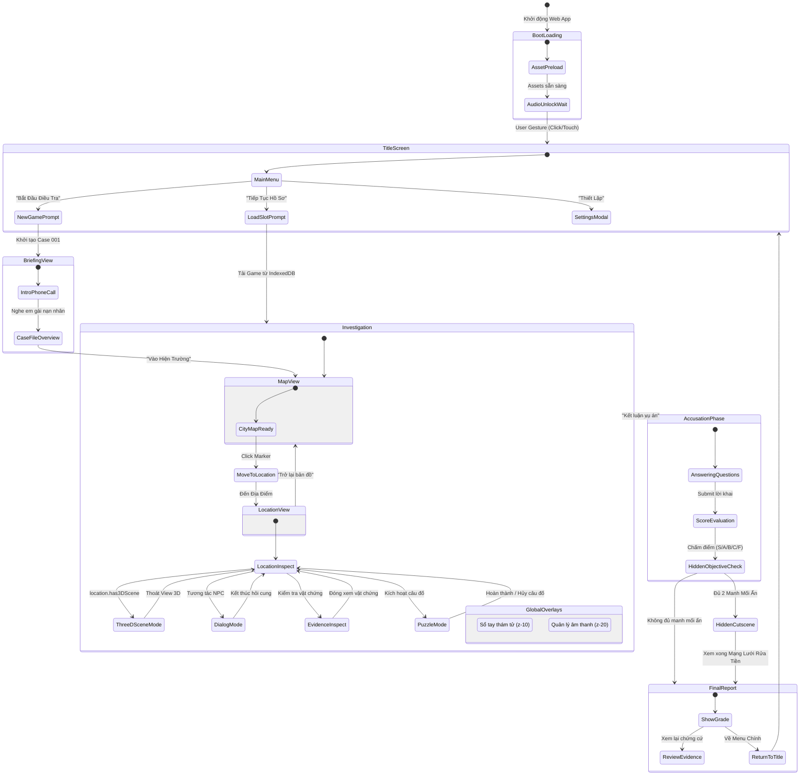

# 🔄 Sơ Đồ Trạng Thái Tổng Thể (Game State Machine)

Tài liệu thiết kế luồng trạng thái máy hữu hạn (FSM) cho **Minh Sát** theo chuẩn `game-production-scoper`.

```mermaid
stateDiagram-v2
    [*] --> BootLoading: Khởi động Web App

    state BootLoading {
        [*] --> AssetPreload
        AssetPreload --> AudioUnlockWait: Assets sẵn sàng
    }

    AudioUnlockWait --> TitleScreen: User Gesture (Click/Touch)

    state TitleScreen {
        [*] --> MainMenu
        MainMenu --> NewGamePrompt: "Bắt Đầu Điều Tra"
        MainMenu --> LoadSlotPrompt: "Tiếp Tục Hồ Sơ"
        MainMenu --> SettingsModal: "Thiết Lập"
    }

    NewGamePrompt --> BriefingView: Khởi tạo Case 001
    LoadSlotPrompt --> Investigation: Tải Game từ IndexedDB

    state BriefingView {
        [*] --> IntroPhoneCall
        IntroPhoneCall --> CaseFileOverview: Nghe em gái nạn nhân
        CaseFileOverview --> MapView: "Vào Hiện Trường"
    }

    state Investigation {
        [*] --> MapView

        state MapView {
            [*] --> CityMapReady
            CityMapReady --> MoveToLocation: Click Marker
        }

        MoveToLocation --> LocationView: Đến Địa Điểm

        state LocationView {
            [*] --> LocationInspect
            LocationInspect --> ThreeDSceneMode: location.has3DScene
            LocationInspect --> DialogMode: Tương tác NPC
            LocationInspect --> EvidenceInspect: Kiểm tra vật chứng
            LocationInspect --> PuzzleMode: Kích hoạt câu đố
        }

        ThreeDSceneMode --> LocationInspect: Thoát View 3D
        DialogMode --> LocationInspect: Kết thúc hỏi cung
        EvidenceInspect --> LocationInspect: Đóng xem vật chứng
        PuzzleMode --> LocationInspect: Hoàn thành / Hủy câu đố

        LocationView --> MapView: "Trở lại bản đồ"

        state GlobalOverlays {
            NotebookDrawer: Sổ tay thám tử (z-10)
            AudioControl: Quản lý âm thanh (z-20)
        }
    }

    Investigation --> AccusationPhase: "Kết luận vụ án"

    state AccusationPhase {
        [*] --> AnsweringQuestions
        AnsweringQuestions --> ScoreEvaluation: Submit lời khai
        ScoreEvaluation --> HiddenObjectiveCheck: Chấm điểm (S/A/B/C/F)
    }

    HiddenObjectiveCheck --> HiddenCutscene: Đủ 2 Manh Mối Ẩn
    HiddenObjectiveCheck --> FinalReport: Không đủ manh mối ẩn
    HiddenCutscene --> FinalReport: Xem xong Mạng Lưới Rửa Tiền

    state FinalReport {
        [*] --> ShowGrade
        ShowGrade --> ReviewEvidence: Xem lại chứng cứ
        ShowGrade --> ReturnToTitle: Về Menu Chính
    }

    ReturnToTitle --> TitleScreen
```
