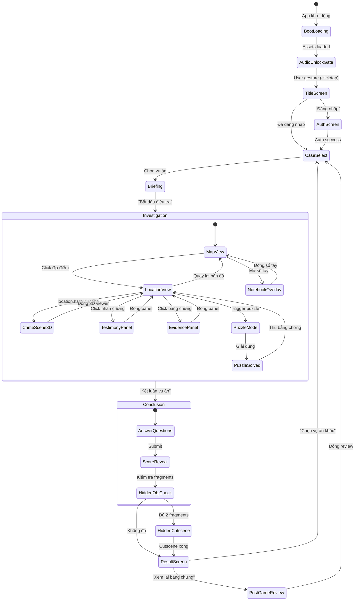

# 🔍 Minh Sát — Audit & Updated Plan

> Ngày audit: 2026-09-18 | Vai trò: Game Lead & Technical Architect

---

## 1. Khảo sát hiện trạng (Project Scan)

### Tồn tại trong dự án

| File / Thư mục | Loại | Trạng thái |
|:---|:---|:---|
| [AGENTS.md](file:///c:/Users/Admin/Documents/antigravity/detective/AGENTS.md) | Core directives | ✅ Hoàn chỉnh |
| [README.md](file:///c:/Users/Admin/Documents/antigravity/detective/README.md) | Mô tả dự án + skills | ✅ Hoàn chỉnh |
| [mcp_config.json](file:///c:/Users/Admin/Documents/antigravity/detective/mcp_config.json) | Puppeteer + Phaser MCP | ✅ Hoàn chỉnh |
| `.agents/rules/web-game-rules.md` | Quy tắc kỹ thuật bắt buộc | ✅ Hoàn chỉnh |
| `.agents/skills/` (10 skills) | Bộ kỹ năng AI Agent | ✅ Đầy đủ 10/10 |

### Tồn tại trong conversation artifacts (chưa trong project)

| Artifact | Nội dung | Trạng thái |
|:---|:---|:---|
| `implementation_plan.md` | Thiết kế tổng thể, tech stack, data models, phases | ✅ Hoàn chỉnh, đã duyệt |
| `case-001-script.md` | Kịch bản đầy đủ Case-001: 5 NV, 5 địa điểm, 12 bằng chứng, 2 puzzles, scoring, hidden obj | ✅ Hoàn chỉnh, đã duyệt |

### Chưa tồn tại (cần xây dựng)

| Hạng mục | Chi tiết |
|:---|:---|
| 🔴 **Project scaffold** | Không có `package.json`, `vite.config.ts`, `tsconfig.json`, `tailwind.config.ts` |
| 🔴 **Source code** | Không có thư mục `src/`, không có file `.ts`/`.tsx` nào |
| 🔴 **Phaser integration** | Chưa tích hợp Phaser vào React |
| 🔴 **Three.js integration** | Chưa tích hợp Three.js (2.5D parallax scenes) |
| 🔴 **Firebase** | Chưa setup Auth / Firestore / Hosting |
| 🔴 **Game scenes** | Chưa có Phaser scenes (Boot, Map, Location, Puzzle) |
| 🔴 **UI components** | Chưa có React components (Notebook, Evidence viewer, Dialog...) |
| 🔴 **Data files** | Kịch bản nằm trong markdown, chưa chuyển sang JSON/Ink |
| 🔴 **Assets** | Không có hình ảnh, audio, 3D models nào |
| 🔴 **Audio system** | Chưa có Howler.js / AudioContext setup |
| 🔴 **Save/Load** | Chưa có IndexedDB / localforage |
| 🔴 **Ink narratives** | Chưa có file `.ink` nào, chưa cài `inkjs` |
| 🔴 **Tests** | Chưa có unit test, visual QA, hay Puppeteer scripts |
| 🔴 **docs/GDD.md** | Chưa có Game Design Document theo chuẩn `game-production-scoper` |

### Kết luận Bước 1

> [!IMPORTANT]
> **Dự án đang ở giai đoạn Pre-Production thuần túy.** Mọi deliverables hiện tại đều là tài liệu thiết kế (plan + kịch bản). Chưa có dòng code nào. Tin tốt: thiết kế rất chắc chắn và chi tiết — nền tảng tốt để bắt tay vào code ngay.

---

## 2. Gap Analysis theo 10 Skills

### 🟢 Tuân thủ | 🟡 Cần điều chỉnh | 🔴 Vi phạm / Chưa có

| # | Skill | Status | Đánh giá chi tiết |
|:--|:---|:---|:---|
| 1 | **web-hybrid-ui-architect** | 🔴 | Chưa có UI nào. Plan đã mô tả đúng hướng (React overlay + Canvas), nhưng chưa code. **Cần đảm bảo**: Canvas `z-index: 1` chỉ render game world; DOM overlay `z-index: 10` cho tất cả text (sổ ghi chép, lời khai, bằng chứng, menu). DPR clamp `≤ 2.0`. |
| 2 | **ink-narrative-engineer** | 🔴 | Toàn bộ hội thoại/lời khai đang nằm trong markdown. **Cần chuyển đổi**: 5 nhân vật × 3 lần lời khai = 15 dialogue nodes → file `.ink` với knots, variables, conditional unlocking, và metadata tags (`# actor:`, `# emotion:`, `# event:`). |
| 3 | **web-storage-audio-policy** | 🔴 | Chưa có hệ thống nào. **Cần xây dựng**: (a) Audio unlock qua user gesture trước khi play BGM; (b) Visibility change handler (mute khi tab ẩn); (c) IndexedDB via `localforage` cho save slots — không dùng `localStorage` làm primary storage. |
| 4 | **game-production-scoper** | 🟡 | Có plan + kịch bản chi tiết, nhưng **thiếu**: `docs/GDD.md` 1 trang theo format chuẩn, State Machine diagram bằng Mermaid, và Micro-Vertical Slice definition chính xác (scope quá rộng cho MVP — 5 locations + 12 evidence + 2 puzzles). |
| 5 | **threejs-lowpoly-explorer** | 🟡 | Plan ghi 2.5D parallax (không full 3D), **phù hợp** nhưng cần điều chỉnh: không cần Rapier physics, không cần `.glb` models. Thay vào đó: multi-layer images + Three.js PlaneGeometry + custom shaders cho lighting. **Vẫn cần**: `.dispose()` cleanup khi đổi scene. |
| 6 | **phaser-grid-puzzle** | 🟡 | Game không dùng grid movement (point-and-click). **Áp dụng một phần**: Phaser scene management, sprite animation, input handling. **Không cần**: Grid Engine, LDtk tilemaps, Sokoban mechanics. |
| 7 | **art-bible-prompt-curator** | 🔴 | Chưa có art bible, chưa lock palette, chưa có AI prompt templates. **Cần tạo**: Dark cinematic palette (Lospec), character portrait prompt formula (semi-realistic, dark tone, nhiều biểu cảm), evidence/location prompt formula. |
| 8 | **asset-packer-optimizer** | ⬜ | Chưa có assets để pack. **Defer** — cần sau khi tạo assets. Nhưng **plan ahead**: cấu trúc thư mục assets sẵn sàng cho texture atlas packing. |
| 9 | **boardgame-state-engine** | 🟡 | Không phải board game turn-based → không dùng `boardgame.io`. **Nhưng áp dụng nguyên tắc cốt lõi**: Headless game logic (unlock conditions, scoring, evidence collection) tách riêng khỏi render. Dùng **Zustand** thay `boardgame.io` nhưng giữ nguyên pattern Model-View decoupling. |
| 10 | **puppeteer-visual-qa** | ⬜ | MCP config đã có. **Defer** — cần sau khi có First Playable. Sẽ viết script verify: canvas mount, DOM overlay hiện, click hotspot → dialogue mở, zero console errors. |

---

## 3. Tổng hợp: Giữ lại / Cần Refactor / Cần làm mới

### ✅ Giữ lại (Keep)

| Item | Lý do |
|:---|:---|
| `AGENTS.md` + `.agents/rules/` | Đúng chuẩn, bao phủ 4 directive chính |
| `mcp_config.json` | Puppeteer + Phaser MCP sẵn sàng |
| 10 Skills | Đầy đủ, không cần bổ sung |
| `implementation_plan.md` — Quyết định thiết kế | Tất cả design decisions đã confirm |
| `implementation_plan.md` — Tech stack | Phaser + Three.js + React + Firebase + Vite + TS — hợp lý |
| `implementation_plan.md` — Data models | TypeScript interfaces cho Case, Location, Character, Evidence — tốt |
| `case-001-script.md` — Cốt truyện | Chặt chẽ, logic, twist hay, 5 nhân vật cân bằng |
| `case-001-script.md` — Scoring system | 5 câu hỏi, 100 điểm, S/A/B/C/F — hoàn chỉnh |
| `case-001-script.md` — Hidden objective (Mạng lưới) | Overarching mystery tự nhiên, hook tốt |

### 🔧 Cần Refactor

| Item | Vấn đề | Hành động |
|:---|:---|:---|
| Hội thoại / lời khai (15 dialogues) | Đang trong markdown, cần `.ink` | Chuyển sang Ink format với tags `# actor:`, `# emotion:`, `# event:EVIDENCE_FOUND:evd-id` |
| Directory structure (plan) | Thiếu `docs/`, `scripts/`, `ink/` | Bổ sung: `src/ink/`, `docs/GDD.md`, `scripts/pack-assets.ts` |
| MVP scope | 5 locations + 12 evidence quá lớn cho MVS | MVS thu hẹp: **2 locations + 4 evidence + 1 puzzle + 2 nhân vật** → mở rộng dần |
| Data model | `Testimony[]` là mảng tĩnh | Thêm `unlockCondition` per testimony, liên kết với Ink variables |
| Phase timeline | 8 tuần chia 4 phase quá thô | Chia thành 18 micro-tasks 30-60 phút |

### 🆕 Cần làm mới (Build New)

| Item | Skill liên quan | Ưu tiên |
|:---|:---|:---|
| Project scaffold (Vite + React + TS + Tailwind) | — | 🔥 P0 |
| Hybrid UI shell (Canvas + DOM overlay) | `web-hybrid-ui-architect` | 🔥 P0 |
| Headless game state engine (Zustand) | `boardgame-state-engine` principle | 🔥 P0 |
| Phaser Boot + Map scene | `phaser-grid-puzzle` (partial) | 🔥 P0 |
| 2.5D crime scene viewer (Three.js) | `threejs-lowpoly-explorer` (adapted) | 🟠 P1 |
| Ink narrative files + inkjs runtime | `ink-narrative-engineer` | 🟠 P1 |
| DOM UI panels (Notebook, Evidence, Testimony) | `web-hybrid-ui-architect` | 🟠 P1 |
| Mini-puzzle (Caesar cipher) | — | 🟠 P1 |
| Conclusion + scoring screen | — | 🟡 P2 |
| Audio system (BGM + SFX + unlock) | `web-storage-audio-policy` | 🟡 P2 |
| Save/Load (IndexedDB) | `web-storage-audio-policy` | 🟡 P2 |
| Firebase Auth + Firestore | — | 🟡 P2 |
| Art bible + AI prompts | `art-bible-prompt-curator` | 🟡 P2 |
| Asset pipeline (texture atlas) | `asset-packer-optimizer` | ⚪ P3 |
| Puppeteer visual QA | `puppeteer-visual-qa` | ⚪ P3 |
| `docs/GDD.md` | `game-production-scoper` | 🔥 P0 |

---

## 4. State Machine tổng thể



---

## 0. Tiến Trình Hiện Tại (Current Progress: V2 True Detective Overhaul Hoàn Tất)

> 🟢 **Trạng thái:** **Đã hoàn thành đại tu toàn diện V2 theo 4 phản hồi của người dùng:**
> 1. ✅ Thay thế toàn bộ placeholder bằng đồ họa điện ảnh (Cinematic 8K Photography): Hiện trường 2.5D, Bản đồ vệ tinh tác chiến Quận 2, Chân dung đa biểu cảm.
> 2. ✅ Hệ thống hỏi cung tương tác kiểu *Ace Attorney*: Chân dung đổi cảm xúc theo thời gian thực (điềm tĩnh $\to$ toát mồ hôi $\to$ suy sụp), Thanh tâm lý nghi phạm, Cơ chế "Đối chất vật chứng" (Present Clue).
> 3. ✅ Đại tu giải mã mật mã: Dựa vào công thức ghi chú hiện trường trên lịch bàn ($5 - 4 = 1$), bắt buộc suy luận bản chất công ty ma "MINH PHÁT", xóa bỏ cơ chế spam phím.
> 4. ✅ Khám nghiệm hiện trường đèn pin tự do (Freeform Flashlight): Xóa bỏ vòng tròn vàng lộ liễu, rọi đèn pin trong bóng tối, raycast trúng vật thể đổi icon kính lúp.

```
[████████████████████████████████████] 100% (MVS V2 Overhaul Hoàn Thành)
```

| Hạng mục | Trạng thái | Ghi chú kiểm thử |
|:---|:---|:---|
| **Sprint 0: Scaffold & Docs** | ✅ Hoàn thành | Vite + React 18 + TS + Tailwind + GDD + StateMachine + ArtBible |
| **Sprint 1: Hybrid UI Shell** | ✅ Hoàn thành | Canvas z-1 + DOM overlay z-10, DPR clamped $\le 2.0$, dark theme |
| **Sprint 2: Headless Game State** | ✅ Hoàn thành | Zustand store, caseData, pure unlock & scoring logic |
| **Sprint 3: Core Game Screens** | ✅ Hoàn thành | Three.js 2.5D diorama (Căn hộ 507) + Phaser 3.90 Map (Quận 2) |
| **Sprint 4: Narrative & Puzzles** | ✅ Hoàn thành | Inkle Ink runtime (`inkjs`), Caesar Cipher puzzle thời gian thực |
| **Sprint 5: Conclusion & Audio** | ✅ Hoàn thành | Audio unlock gate, mưa đêm thủ tục, Cáo buộc & Xếp hạng S/A/B/C/F |
| **Sprint 6: Persistence & Polish** | ✅ Hoàn thành | IndexedDB multi-slot via `localforage`, 0 console errors |
| **Post-MVS: Mở rộng Case 001** | ⏳ Tiếp theo | Mở rộng 3 locations, 3 characters, 8 evidence (T17) |
| **Post-MVS: Firebase Integration**| ⏳ Tiếp theo | Auth Google/Email, Firestore cloud save, Hosting (T18) |

---

## 5. Lộ trình Micro-Vertical Slice (18 Tasks)

> [!TIP]
> **Micro-Vertical Slice (MVS)** = phiên bản nhỏ nhất có thể chơi được:
> - **2 địa điểm**: Căn hộ 507 (3D scene) + Sảnh bảo vệ (2D)
> - **2 nhân vật**: Ông Sơn (hàng xóm) + Huy (bảo vệ)
> - **4 bằng chứng**: EVD-01 (ly cà phê), EVD-03 (ban công), EVD-05 (CCTV gap), EVD-07 (dây thừng) + EVD-12 (mật mã)
> - **1 puzzle**: Caesar cipher (NJOI QIBU → MINH PHAT)
> - **Kết luận + chấm điểm** (3 câu hỏi giám định + Xếp hạng S 100đ + Cutscene Mạng Lưới Rửa Tiền)
>
> Toàn bộ MVS đã hoàn tất! Bước tiếp theo: mở rộng sang giai đoạn Post-MVS.

---

### Sprint 0 — Scaffold & Docs (1h)

- [x] **T01** — Project init (30 phút)
  - `npm create vite@latest minh-sat -- --template react-ts`
  - Cài dependencies: `phaser`, `three`, `@types/three`, `zustand`, `react-router-dom`, `tailwindcss`, `localforage`, `inkjs`, `howler`
  - Cấu hình `vite.config.ts`, `tailwind.config.ts`, `tsconfig.json`
  - Tạo cấu trúc thư mục theo plan (src/components, src/scenes, src/three, src/data, src/store, src/ink, src/types)
  - Verify: `npm run dev` chạy được, hiện blank page

- [x] **T02** — GDD & State Machine docs (30 phút)
  - Tạo `docs/GDD.md` theo format `game-production-scoper`: High Concept, Core Loop, 3 Pillars, 3 Phases
  - Chuyển State Machine diagram vào `docs/STATE_MACHINE.md`
  - Tạo `docs/ART_BIBLE.md` placeholder (palette + prompt templates)

---

### Sprint 1 — Hybrid UI Shell (1.5h)

- [x] **T03** — Hybrid UI container (30 phút)
  - Tạo `GameContainer.tsx`: `<div>` wrapper chứa `<canvas>` (z-index 1) + DOM overlay `<div>` (z-index 10)
  - Implement DPR clamping: `Math.min(window.devicePixelRatio || 1, 2.0)`
  - CSS: overlay `pointer-events: none`, interactive children `pointer-events: auto`
  - Dark theme base styles (Tailwind: `bg-gray-950 text-gray-100`)
  - Verify: Canvas và overlay render đúng z-index, text sắc nét trên mobile

- [x] **T04** — Phaser bootstrap trong React (30 phút)
  - `usePhaserGame` custom hook: khởi tạo Phaser.Game trong `useEffect`, cleanup `.destroy()` on unmount
  - BootScene: load placeholder assets, hiện loading bar
  - DPR-aware renderer: `resolution: Math.min(window.devicePixelRatio, 2.0)`
  - Phaser `Scale.FIT` + `autoCenter: CENTER_BOTH`
  - Verify: Phaser canvas render bên trong `GameContainer`, resize responsive

- [x] **T05** — React Router + screen shells (30 phút)
  - Routes: `/` (Title), `/cases` (CaseSelect), `/play/:caseId` (Game)
  - `TitleScreen.tsx`: logo + nút "Bắt đầu" (audio unlock gate)
  - `CaseSelectScreen.tsx`: danh sách cases (placeholder)
  - `GameScreen.tsx`: chứa `GameContainer` (Phaser + overlay)
  - Verify: Navigate giữa các routes, Phaser chỉ mount ở `/play/`

---

### Sprint 2 — Headless Game State (1.5h)

- [x] **T06** — Game state engine (Zustand) (45 phút)
  - `src/store/gameStore.ts`: case data, current location, unlocked locations, collected evidence, unlocked testimonies, notebook entries
  - `src/store/notebookStore.ts`: evidence log, character notes, timeline entries, player annotations
  - Pure functions: `canUnlockLocation(state, locationId)`, `canUnlockTestimony(state, charId, level)`, `calculateScore(state, answers)`
  - **Headless principle**: tất cả logic kiểm tra unlock condition, scoring — không phụ thuộc render
  - Verify: Unit test logic functions (unlock conditions, scoring) pass

- [x] **T07** — Case data loader (45 phút)
  - Chuyển `case-001-script.md` → `src/data/cases/case-001/case.json` (MVS subset: 2 locations, 2 characters, 4 evidence)
  - TypeScript types: `Case`, `Location`, `Character`, `Evidence`, `Testimony`, `Solution` (dựa trên plan)
  - `useCaseData(caseId)` hook: load JSON, validate, inject vào gameStore
  - Verify: Console.log case data loaded correctly

---

### Sprint 3 — Core Game Screens (2h)

- [x] **T08** — Phaser MapScene (45 phút)
  - Render bản đồ đơn giản (2D, background image hoặc drawn)
  - Location markers (sprites/circles) tại các vị trí từ `case.json`
  - Locked/unlocked visual state (mờ vs sáng)
  - Click marker → emit event → React navigate hoặc overlay
  - Verify: 2 markers hiện (Căn hộ 507 sáng, Sảnh sáng), click → chuyển scene

- [x] **T09** — 2.5D Crime Scene (Three.js) (45 phút)
  - `CrimeSceneViewer.tsx`: mount Three.js renderer trong React component
  - 3 parallax layers: background (phòng tối), mid-ground (đồ vật), foreground (bằng chứng)
  - Placeholder images (solid color planes hoặc AI-generated test images)
  - Mouse/touch parallax effect (camera offset based on pointer position)
  - Interactive hotspots: Raycasting click → emit `onHotspotClick(evidenceId)`
  - **DPR clamp** + **`.dispose()` cleanup** on unmount
  - Verify: Parallax moves khi di chuột, click hotspot → console.log

- [x] **T10** — DOM UI panels (30 phút)
  - `TestimonyPanel.tsx`: hiện lời khai nhân vật (từ Zustand state), locked/unlocked levels
  - `EvidencePanel.tsx`: hiện chi tiết bằng chứng khi click (hình ảnh + mô tả)
  - `NotebookDrawer.tsx`: slide-in panel hiện danh sách evidence đã thu, nhân vật đã gặp
  - Tailwind dark theme: `bg-gray-900/95 backdrop-blur-sm border-gray-700`
  - Verify: Panels mở/đóng, content hiện đúng từ store

---

### Sprint 4 — Narrative & Puzzles (1.5h)

- [x] **T11** — Ink narrative integration (45 phút)
  - Chuyển lời khai 2 nhân vật (Sơn + Huy) từ markdown → `src/ink/case-001/testimonies.ink`
  - Ink structure: knots per character, variables cho evidence flags (`VAR has_evd05 = false`), conditional testimony unlocking
  - `useInkStory` hook: load compiled `.json`, `Continue()`, `ChooseChoiceIndex()`, parse `# actor:` / `# emotion:` tags
  - Wire vào `TestimonyPanel`: hiện text từ Ink, cập nhật store khi event tag fired
  - Verify: Nói chuyện với Sơn → lời khai lần 1 hiện, thu EVD-07 → lời khai lần 3 mở khóa

- [x] **T12** — Caesar cipher puzzle (45 phút)
  - `CipherPuzzle.tsx` (DOM overlay, không phải canvas): bảng chữ cái vòng tròn xoay, input shift number, preview real-time
  - Logic headless: `solveCaesar(cipherText, shift)` pure function
  - Hint system: 3 gợi ý (miễn phí, -5đ, -10đ) — track trong `notebookStore`
  - Trigger: click EVD-12 trong crime scene → mở puzzle overlay
  - On solve: dispatch `collectEvidence('EVD-12')` + `addNotebookEntry('MINH PHÁT — tên công ty?')`
  - Verify: Xoay shift -1 → "MINH PHÁT" hiện, bằng chứng được thu

---

### Sprint 5 — Conclusion & Audio (1.5h)

- [x] **T13** — Conclusion flow (45 phút)
  - `ConclusionScreen.tsx`: 3 câu hỏi rút gọn cho MVS (Tự tử hay giết người? / Ai? / Vào bằng cách nào?)
  - Scoring logic (headless `calculateScore()` đã viết ở T06)
  - `ScoreReveal.tsx`: hiện điểm + hạng (S/A/B/C/F) với animation
  - Hidden objective check: `state.hasFragment1 && state.hasFragment2` → trigger cutscene
  - `HiddenCutscene.tsx`: text reveal "Mạng lưới" (scroll text với typing effect)
  - Verify: Trả lời đúng hết → 100đ + hạng S, sai hết → F

- [x] **T14** — Audio system (45 phút)
  - `src/audio/AudioManager.ts`: Singleton wrap Howler.js
  - **Audio unlock gate**: `TitleScreen` nút click → `AudioContext.resume()` + `Howler.ctx.resume()`
  - `visibilitychange` handler: mute khi tab hidden
  - BGM: 1 track atmospheric dark ambient (placeholder hoặc royalty-free)
  - SFX: 3-4 sounds (click, evidence found, page turn, puzzle solved)
  - Verify: BGM plays sau click Title, mute khi đổi tab, SFX trigger đúng events

---

### Sprint 6 — Persistence & Polish (1h)

- [x] **T15** — Save/Load system (IndexedDB) (30 phút)
  - `src/storage/SaveManager.ts`: `localforage` wrapper
  - Schema: `{ version, timestamp, slotId, caseId, gameState, notebookState, inkStoryStateJson }`
  - Auto-save: mỗi khi thu bằng chứng hoặc đổi location
  - Load: khi vào `/play/:caseId`, check existing save → prompt continue/new
  - **Không dùng `localStorage`** cho game state chính
  - Verify: Thu bằng chứng → refresh page → progress vẫn còn

- [x] **T16** — Visual polish pass (30 phút)
  - Responsive breakpoints: 375px (mobile), 768px (tablet), 1440px (desktop)
  - Dark theme final: custom colors, proper contrast (WCAG AA ≥ 4.5:1)
  - Transitions: panel slide-in (150-300ms), evidence collect animation
  - Loading states: skeleton screens cho panels
  - Verify: Lighthouse accessibility score ≥ 90

---

### Post-MVS — Mở rộng

- [ ] **T17** — Expand case content: thêm 3 locations (Café Nocturne, VP SaigonTech, Hành lang kỹ thuật tầng 5), 3 nhân vật (Lê Thu Hằng, Nguyễn Văn Khoa, Phạm Thị Mai), 8 bằng chứng còn lại, Puzzle CCTV timeline
- [ ] **T18** — Firebase integration: Auth (Google/Email), Firestore (save cloud + leaderboard), Hosting (deploy web app)

---

## Tổng kết thời gian

| Sprint | Nội dung | Thời gian |
|:---|:---|:---|
| Sprint 0 | Scaffold & Docs | 1h |
| Sprint 1 | Hybrid UI Shell | 1.5h |
| Sprint 2 | Headless Game State | 1.5h |
| Sprint 3 | Core Game Screens | 2h |
| Sprint 4 | Narrative & Puzzles | 1.5h |
| Sprint 5 | Conclusion & Audio | 1.5h |
| Sprint 6 | Persistence & Polish | 1h |
| **Tổng MVS** | **First Playable** | **~10h** |
| Post-MVS | Full Case + Firebase | ~6h |
| **Tổng dự án** | **Complete Case-001** | **~16h** |
