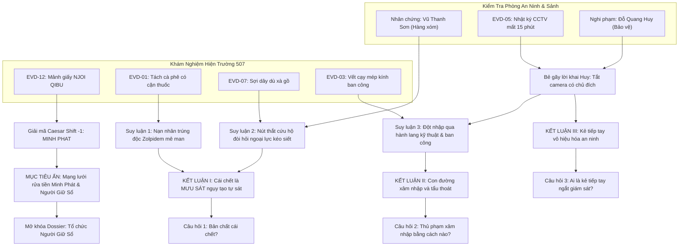

# 📊 ĐỒ THỊ SUY LUẬN & KIỂM TOÁN LOGIC (PDG): VỤ ÁN CĂN HỘ 507
## Case 001: The Locked-Room Staged Suicide

---

## 1. SỰ THẬT HIỆN TRƯỜNG (THE GROUND TRUTH)

* **Nạn nhân:** Trần Minh Đức (38 tuổi), Giám đốc SaigonTech (tiền thân là Xí nghiệp Kỹ thuật Viễn thông Minh Sát).
* **Thời gian tử vong:** 22:10 – 22:15, đêm 18/09.
* **Nguyên nhân chết:** Ngạt thở cơ học do treo cổ, nhưng nạn nhân trước đó đã bị đánh thuốc mê liều cao (Zolpidem) hòa trong tách cà phê.
* **Hung thủ thực tế:** Vũ Trọng Bằng (sát thủ chuyên nghiệp do tổ chức "Người Giữ Sổ" cử tới).
* **Động cơ:** Bịt đầu mối sau khi Đức sao chép chứng từ kế toán rửa tiền của Công ty bình phong Minh Phát.
* **Thủ đoạn dàn dựng phòng kín (Staging):**
  1. Hung thủ hối lộ bảo vệ Đỗ Quang Huy 50 triệu đồng tiền mặt để rút jack nguồn camera tầng 5 đúng 15 phút (từ 22:05 đến 22:20) và mở chốt cửa hành lang kỹ thuật.
  2. Hung thủ lẻn vào hành lang kỹ thuật, dùng xà beng nhỏ nạy mép ron cao su cửa kính ban công căn 507 (vốn đã bị mở hé hoặc chốt lỏng).
  3. Đức lúc này đã ngấm thuốc ngủ Zolpidem gục trên bàn làm việc. Hung thủ đưa thi thể ra xà gồ, dùng **nút thắt dây dù cứu nạn đường sông (rescue slip-knot)** kéo căng từ phía ngoài rồi thả trọng lượng thi thể rơi tự do xuống sàn lúc 22:15 (tạo tiếng "BỊCH" sang căn 508).
  4. Hung thủ kiểm tra chốt xoay cửa chính bên trong đã khóa sẵn, rút lui qua đường ban công, kéo khép hờ cửa kính và tẩu thoát theo cầu thang bộ thoát hiểm trước 22:20 khi camera bật lại.

---

## 2. MA TRẬN BẤT ĐỐI XỨNG NGHI PHẠM (SUSPECT ASYMMETRY MATRIX)

| Nhân Vật | Điều Họ Biết (Knowledge) | Điều Họ Giấu (Secret) | Động Cơ Nói Dối (Motive to Lie) | Yếu Huyệt Tâm Lý (Pressure Point) |
| :--- | :--- | :--- | :--- | :--- |
| **Vũ Thanh Sơn** *(Hàng xóm 508, cựu quân nhân)* | • Nghe tiếng cãi vã lúc 20:30. • Nghe tiếng vật nặng rơi lúc 22:15. • Nhận ra nút thắt dây dù của đội cứu hộ đường sông. | Từng quen biết nạn nhân qua sở thích chơi radio cũ, sợ bị công an thẩm vấn phiền hà ảnh hưởng con cái. | Tính cảnh giác người lính già; ghét bị nghi ngờ; sợ dính líu đến chuyện mờ ám của giới làm ăn mới nổi. | **`EVD-07` (Ảnh nút thắt dây dù):** Đánh vào lòng tự trọng và chuyên môn quân ngũ của ông để ông phân tích cấu tạo cơ học của nút thắt. |
| **Đỗ Quang Huy** *(Bảo vệ ca đêm)* | • Biết chính xác kẻ lạ mặt đi giày da đen đã lên tầng 5. • Biết camera bị tắt chủ đích. | Nhận hối lộ 50 triệu đồng; đang nợ cờ bạc cá độ bóng đá 200 triệu bị giang hồ đe dọa. | Sợ bị khép tội đồng phạm giết người và sợ bị chủ nợ thanh toán. | **`EVD-05` (Băng CCTV 15 phút)** kết hợp với **`EVD-03` (Vết cạy ban công hành lang kỹ thuật):** Bẻ gãy lời biện minh "chập nguồn ngẫu nhiên", dồn hắn vào thế tòng phạm án mạng. |

---

## 3. THE THREE-CLUE RULE: BẢO ĐẢM SUY LUẬN KHÔNG ĐIỂM NGHẼN

### Kết luận 1: Nạn nhân KHÔNG tự sát mà bị sát hại trước
* **Vector 1 (Forensic/Pháp y):** `EVD-01` (Tách cà phê chứa Zolpidem liều cao) $\rightarrow$ Nạn nhân mê man bất tỉnh trước khi chết.
* **Vector 2 (Vật chứng cơ học):** `EVD-07` (Nút thắt dây dù cứu hộ) $\rightarrow$ Cần người ngoài kéo siết, người tự vẫn không thể tự thắt.
* **Vector 3 (Nhân chứng):** Lời khai cấp 2 của ông Sơn $\rightarrow$ Tiếng "bịch" xảy ra lúc 22:15, cách thời điểm cãi vã hơn 1 tiếng.

### Kết luận 2: Hung thủ đột nhập từ ban công và có tay trong vô hiệu hóa camera
* **Vector 1 (Kỹ thuật số):** `EVD-05` (Khoảng trống camera 15 phút từ 22:05 – 22:20).
* **Vector 2 (Vật chứng hiện trường):** `EVD-03` (Vết nạy kim loại ở khung ron cao su cửa kính ban công).
* **Vector 3 (Lời thú tội):** Lời khai cấp 3 của bảo vệ Huy $\rightarrow$ Thừa nhận mở cửa kỹ thuật và rút jack cam cho kẻ đi giày da đen.

---

## 4. PUZZLE DEPENDENCY GRAPH (MERMAID DAG)

