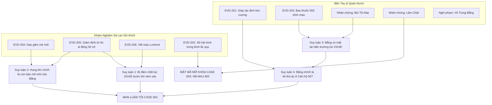

# 📊 ĐỒ THỊ SUY LUẬN & KIỂM TOÁN LOGIC (PDG): CASE 002
## Case 002: Bóng Đêm Bến Bạch Đằng

---

## 1. SỰ THẬT HIỆN TRƯỜNG (THE GROUND TRUTH)
* **Nạn nhân:** Lê Văn Tài (45 tuổi), tài công trưởng sà lan SG-0419.
* **Thời gian tử vong:** Đúng 01:35 sáng ngày 28/09 (kim đồng hồ Poljot vỡ kim khi rơi xuống nước).
* **Nguyên nhân chết:** Nhát dao găm chuyên dụng đâm đứt tủy sống sau gáy từ phía sau.
* **Hung thủ:** Vũ Trọng Bằng (Thanh tra Minh Phát / Sát thủ giày da từ Case 001).
* **Động cơ:** Tài tống tiền 100 cây vàng vì nắm giữ sổ hải trình chuyến hàng lậu bo mạch viễn thông và ngoại tệ của Minh Phát.

---

## 2. THE THREE-CLUE RULE
### Kết luận 1: Tài công bị mưu sát trước khi rơi xuống sông
1. *Forensic:* `EVD-205` (Vết thương đứt tủy sống cổ, phổi không chứa nước phù nề).
2. *Hiện trường:* `EVD-206` (Vệt máu kéo lê từ buồng lái ra mạn tàu phản ứng với Luminol).
3. *Thời gian:* `EVD-205` (Đồng hồ Poljot vỡ kính đứng lại đúng 01:35).

### Kết luận 2: Vũ Trọng Bằng là thủ phạm và là kẻ thủ ác ở Căn hộ 507
1. *Vũ khí:* `EVD-204` (Dao găm đặc nhiệm mẻ mũi dưới khoang máy khớp mảnh kim loại trong cổ nạn nhân).
2. *Dấu vết:* `EVD-201` (Đôi giày da rãnh kim cương trùng dấu chân ban công Case 001).
3. *Nhân chứng:* Lời khai chị Mai nhận diện gã mua thuốc lá 555 ngoại dính máu (`EVD-203`) lúc 01:40.

---

## 3. PUZZLE DEPENDENCY GRAPH (MERMAID DAG)

