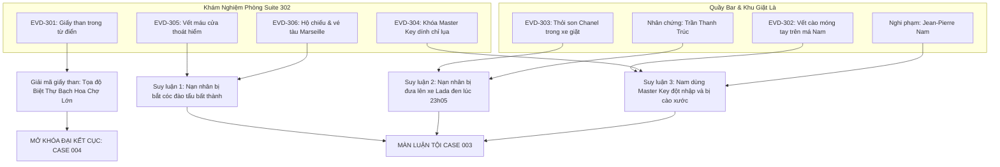

# 📊 ĐỒ THỊ SUY LUẬN & KIỂM TOÁN LOGIC (PDG): CASE 003
## Case 003: Bản Báo Cáo Cháy Dở Tại Majestic

---

## 1. SỰ THẬT HIỆN TRƯỜNG (THE GROUND TRUTH)
* **Nạn nhân:** Hoàng Thục Trinh (32 tuổi), Kế toán trưởng Ngân hàng Ngoại thương.
* **Thời gian xảy ra:** 22:30 – 23:05 đêm 05/10.
* **Hung thủ:** Jean-Pierre Nam (Quản lý ca đêm khách sạn Majestic) tay sai của Người Giữ Sổ.
* **Thủ đoạn:** Dùng Master Key đột nhập phòng 302, khống chế ép Trinh đốt hồ sơ trong bồn tắm, nhét Trinh vào thùng xe giặt là để đưa lên xe Lada đen biển số ngoại giao tẩu thoát về Chợ Lớn.

---

## 2. THE THREE-CLUE RULE
### Kết luận 1: Hoàng Thục Trinh bị bắt cóc ép buộc (không tự ý bỏ trốn)
1. *Forensic:* `EVD-305` (Vết máu nhóm AB của Trinh dính trên tay nắm cửa thoát hiểm).
2. *Vật chứng:* `EVD-306` (Hộ chiếu và vé tàu viễn dương đi Marseille sáng hôm sau vẫn còn trong hộc bàn).
3. *Nhân chứng:* Lời khai của nhân viên Trúc chứng kiến Nam đẩy thùng vải giặt đưa người lên xe Lada đen.

### Kết luận 2: Jean-Pierre Nam là kẻ trực tiếp ra tay
1. *Forensic:* `EVD-302` (Mẫu da dưới móng tay gãy của Trinh khớp vết cào trên gò má Nam).
2. *Vật chứng:* `EVD-304` (Chìa khóa Master Key dính sợi chỉ tơ lụa màu xanh từ áo ngủ của Trinh).
3. *Thú tội:* Lời thú nhận sụp đổ tâm lý của Nam khi bị đối chất.

---

## 3. PUZZLE DEPENDENCY GRAPH (MERMAID DAG)

