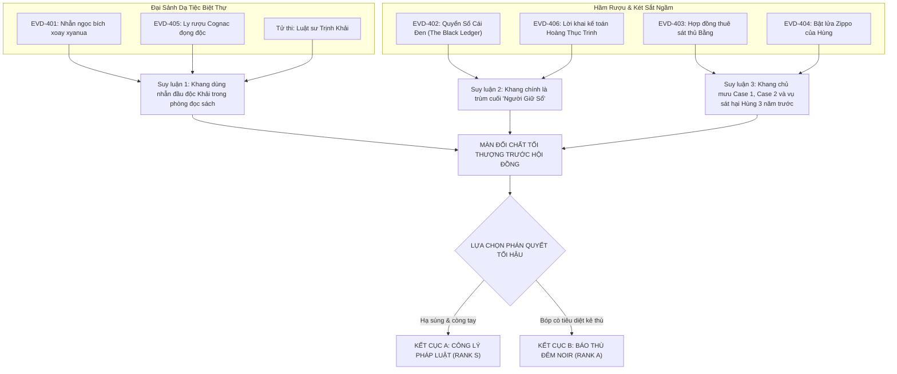

# 📊 ĐỒ THỊ SUY LUẬN & KIỂM TOÁN LOGIC (PDG): CASE 004
## Case 004: Đêm Phán Quyết Tại Biệt Thự Chợ Lớn

---

## 1. SỰ THẬT HIỆN TRƯỜNG (THE GROUND TRUTH)
* **Nạn nhân:** Luật sư Trịnh Khải (46 tuổi).
* **Thời gian tử vong:** 21:35 ngày 12/10.
* **Nguyên nhân:** Ngộ độc Kali Xyanua cực độc rắc vào ly rượu Cognac.
* **Kẻ chủ mưu tối thượng:** Lý Gia Khang (Chủ tịch Hội đồng / "Người Giữ Sổ").
* **Động cơ:** Diệt khẩu Khải trước khi Khải nộp hồ sơ chuộc Trinh và đổ tội giết người cho Thám tử Phong.

---

## 2. THE THREE-CLUE RULE & MẮT XÍCH ĐẠI KẾT CỤC
### Kết luận 1: Luật sư Khải bị sát hại bằng nhẫn ngọc bích xyanua
1. *Forensic:* `EVD-405` (Ly rượu Cognac có vết cặn Kali Xyanua bám ngoài miệng ly).
2. *Vật chứng cơ học:* `EVD-401` (Nhẫn ngọc bích có chốt xoay cơ học chứa cặn bột độc trên tay Khang).
3. *Di ngôn:* Lời trăn trối viết bằng máu của luật sư Khải chỉ điểm chiếc nhẫn.

### Kết luận 2: Lý Gia Khang là "Người Giữ Sổ" đứng sau toàn bộ 4 vụ án
1. *Tài liệu:* `EVD-402` (Quyển Sổ Cái Đen trong két sắt hầm rượu ghi chép 14 công ty ma).
2. *Hợp đồng:* `EVD-403` (Bản ủy nhiệm thuê sát thủ Bằng thanh trừng Case 001 & Case 002).
3. *Kỷ vật lịch sử:* `EVD-404` (Bật lửa Zippo của Thượng úy Nguyễn Hùng có số seri riêng của Khang).

---

## 3. PUZZLE DEPENDENCY GRAPH (MERMAID DAG)

